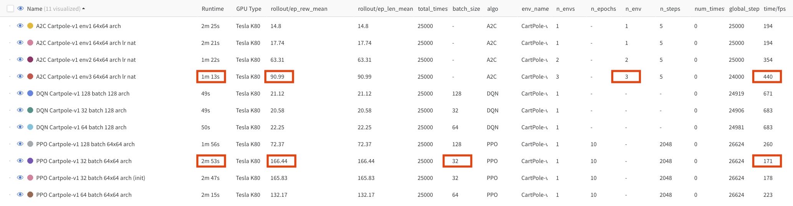

# Reinforcement_Learning_Final_Project

* Project Description: 
This is a project for COMS 6998 (Practical Deep Learning Systems Performance). 
The goal of this project is to explore various Deep Reinforcement Learning algorithms and strategies 
for the Cartpole problem and to compare and contrast their performances to see what is ideal.
The Cartpole models used for evaluation were run in Colab on a Tesla K80, while the sonic models were run on a Windows 10 with a Titan RTX GPU.

* Repository:
The files include various deep reinforcement learning algorithms (DQN, A2C, PPO) implemented in OpenAI Gym,
Stable-Baseline3 and integrated with Weights and Bias tracking API. 

* Example code:
$ python Cartpole_DQN.py 

This will result in multiple folders being created for this run (models, runs, videos, and sub folders in wandb folder).

Results:

- The best performing algorithm was PPO in terms of reward, though it did take the longest to complete and was the most computationally expensive.
  - Increasing batch-size appeared to decrease reward and compute time
- The worst performing was vanilla DQN, as it plateaued in terms of rewards, though it was faster in runtime and computationally cheaper
  - Increasing batch-size didn't change much
- A2C might have been a better balance of both worlds, as it had higher returns than DQN but was also more efficient
  - increasing the number of environments (i.e. actors) increased reward and runtime

 
 
 
 
 
